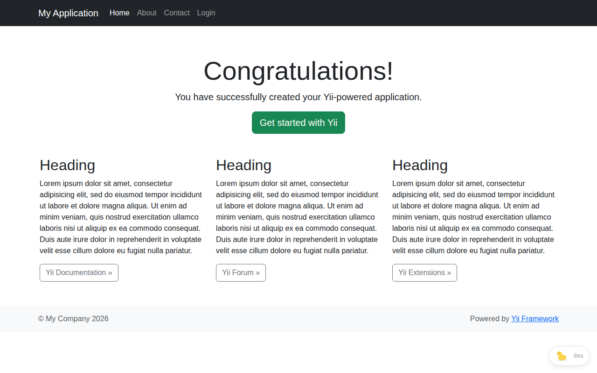
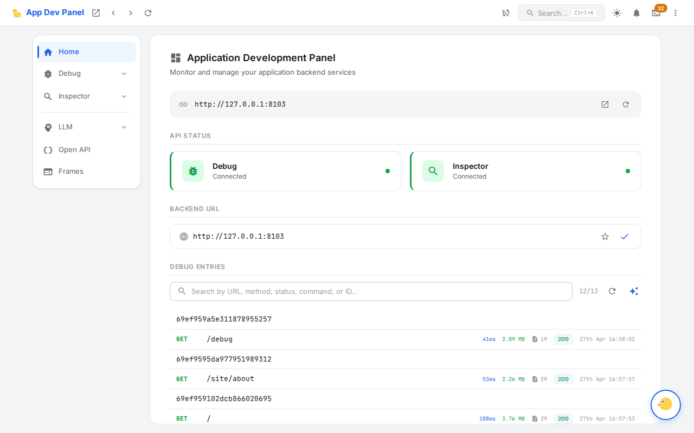

# ADP — Yii 2 Install Guide (re-run)

End-to-end install walkthrough into a fresh `yii2-app-basic` project, validated
against the **post-fix branch** (`claude/setup-ui2-driver-kmilT`, target release
v0.3). Every step here was actually executed; the screenshots in
`demo/screenshots/` are produced by exactly this flow.

If you are installing from Packagist v0.2 today, the same steps apply but
v0.2 ships without the install-time warnings, the `routePrefix` escape hatch,
and the FrontendAssets-based asset publishing — see the original report
for the workarounds.

---

## 0. Prerequisites

- PHP **8.4+** with PCOV or Xdebug (only if you want code-coverage capture)
- Composer 2
- Node 22+ + npm (only if you build the panel from source — releases ship pre-built bundles)

## 1. Create a fresh Yii 2 basic application

```bash
composer create-project --prefer-dist yiisoft/yii2-app-basic yii2-demo
cd yii2-demo
```

You get a stock template with `web/index.php`, `config/web.php`, the bundled
`yii2-debug` dev-dependency and Gii. We will keep Gii and disable yii2-debug
because it claims the same `/debug/*` routes ADP needs.

## 2. Install the adapter

```bash
composer require app-dev-panel/adapter-yii2
```

Composer pulls the adapter plus its transitive dependencies:

| Package | Role |
|---------|------|
| `app-dev-panel/kernel` | Debugger lifecycle + collectors (framework-agnostic) |
| `app-dev-panel/api` | HTTP layer: REST, SSE, panel/toolbar serving |
| `app-dev-panel/cli` | `adp` console binary, `frontend:update`, `serve` |
| `app-dev-panel/mcp-server` | MCP server for AI assistants |
| `app-dev-panel/frontend-assets` | **Prebuilt panel SPA + toolbar bundle** at `vendor/.../frontend-assets/dist/` |

The `extra.bootstrap` entry on the adapter auto-registers the
`AppDevPanel\Adapter\Yii2\Bootstrap` class via `yiisoft/yii2-composer`, so
the module wires itself into the app on first request. **Stop here and look
at your log file** — `Bootstrap::bootstrap()` emits two warnings on a stock
basic-template install before you fix the config:

```
warning [app-dev-panel] yiisoft/yii2-debug is registered as module "debug"
        alongside ADP. Both handle routes under /debug/* — yii2-debug will
        intercept the panel. ...
warning [app-dev-panel] ADP requires UrlManager::$enablePrettyUrl = true —
        without pretty URLs the /debug routes fall back to r=… parsing and
        the panel returns 404 / the homepage. ...
```

Both warnings tell you exactly what to change next.

## 3. Configure `config/web.php`

Edit three things:

1. Add `urlManager` to `components` (pretty URLs on, no script name).
2. Add `app-dev-panel` to `bootstrap` and the `modules` map.
3. Remove the `yii2-debug` module registration (or rename it via `routePrefix`
   if you want to keep both).

```php
$config = [
    'id' => 'basic',
    'basePath' => dirname(__DIR__),
    'bootstrap' => ['log', 'app-dev-panel'],          // <-- add 'app-dev-panel'
    'modules' => [                                     // <-- add the module
        'app-dev-panel' => [
            'class' => \AppDevPanel\Adapter\Yii2\Module::class,
        ],
    ],
    // ... aliases ...
    'components' => [
        // ... existing components ...
        'db' => $db,
        'urlManager' => [                              // <-- REQUIRED by ADP
            'enablePrettyUrl' => true,
            'showScriptName'  => false,
            'rules'           => [],
        ],
    ],
    'params' => $params,
];

if (YII_ENV_DEV) {
    // yii2-debug intentionally NOT registered — same /debug/* prefix as ADP.
    $config['bootstrap'][] = 'gii';
    $config['modules']['gii'] = ['class' => 'yii\gii\Module'];
}
```

If you must keep yii2-debug for legacy reasons, mount ADP under a different
prefix:

```php
'modules' => [
    'app-dev-panel' => [
        'class' => \AppDevPanel\Adapter\Yii2\Module::class,
        'routePrefix' => 'adp',                        // panel at /adp
        'inspectorRoutePrefix' => 'adp-inspect',
    ],
],
```

## 4. Start the server and visit the panel

```bash
PHP_CLI_SERVER_WORKERS=3 php -S 127.0.0.1:8103 -t web
```

`PHP_CLI_SERVER_WORKERS>=3` is required — the panel makes concurrent
requests (SSE + entry data fetching) that deadlock a single-worker server.

Open `http://127.0.0.1:8103/`. The toolbar pill appears in the bottom-right
corner of every HTML response:



Visit a few more pages (`/site/about`, `/site/contact`) to generate debug
entries, then open `http://127.0.0.1:8103/debug`:



The panel home shows:

- `Debug` and `Inspector` API status — both **Connected**.
- The current backend URL (`http://127.0.0.1:8103`).
- A list of captured entries, one per request.

Click any entry to drill into Logs / Database / Events / Timeline collectors.

## 5. How asset serving works

`Module::publishBundledAssets()` runs once per Yii bootstrap and creates a
symlink:

```
demo/yii2-demo/web/app-dev-panel
  → /home/user/.../vendor/app-dev-panel/frontend-assets/dist
```

That symlink lets the PHP built-in server (and any production webserver)
serve the SPA + toolbar straight from the Composer-installed bundle:

| URL | Resolves to |
|-----|-------------|
| `/app-dev-panel/bundle.js` | panel SPA entry |
| `/app-dev-panel/index.html` | panel HTML |
| `/app-dev-panel/toolbar/bundle.js` | toolbar widget |
| `/app-dev-panel/assets/*` | Vite-chunked panel sub-bundles |

Resolution priority (`FrontendAssets::resolve()`):

1. `vendor/app-dev-panel/frontend-assets/dist/` — canonical, release-pinned.
2. Adapter-local `vendor/.../adapter-yii2/resources/dist/` — local
   `make build-panel` development workflow.
3. `PanelConfig::DEFAULT_STATIC_URL` (`https://app-dev-panel.github.io/app-dev-panel/demo`) — last-resort CDN.

## 6. Update the panel later

Two channels:

```bash
# Composer-managed install
composer update app-dev-panel/frontend-assets

# PHAR / Composer-less install — fetches frontend-dist.zip from the latest
# GitHub Release and extracts panel + toolbar into --path
php vendor/bin/adp frontend:update check
php vendor/bin/adp frontend:update download --path=public/adp-panel
```

The CLI emits a warning if the target path has `index.html` but no
`toolbar/bundle.js` — covers users with archives produced before the toolbar
was bundled.

## 7. Verification checklist

After step 4 you should see:

- [x] `GET /` → 200 with `X-Debug-Id` response header and the toolbar pill in
      the corner.
- [x] `GET /debug` → 200 with `<title>App Dev Panel</title>` and the React
      SPA mounted in `<div id="root">`.
- [x] `GET /app-dev-panel/bundle.js` → 200 (panel SPA loaded from
      `frontend-assets`).
- [x] `GET /app-dev-panel/toolbar/bundle.js` → 200 (toolbar bundle).
- [x] No `yii2-debug` toolbar at the top of the page.
- [x] Log file (`runtime/logs/app.log`) clean — no `[app-dev-panel]`
      warnings.

Smoke-test from the command line:

```bash
curl -sI http://127.0.0.1:8103/ | grep X-Debug-Id
curl -sI http://127.0.0.1:8103/debug | grep -E 'HTTP|Content-Type'
curl -s -o /dev/null -w "%{http_code} bundle.js\n" http://127.0.0.1:8103/app-dev-panel/bundle.js
curl -s -o /dev/null -w "%{http_code} toolbar/bundle.js\n" http://127.0.0.1:8103/app-dev-panel/toolbar/bundle.js
```

Expected output:

```
X-Debug-Id: <hex>
HTTP/1.1 200 OK
Content-Type: text/html; charset=utf-8
200 bundle.js
200 toolbar/bundle.js
```

---

## What this guide does not cover

- **Production deployment.** `adp serve --frontend-path=…` and Symfony's
  `app-dev-panel:assets:install` provide alternatives to the symlink-based
  publishing flow used here.
- **`allowedIps` / `authToken`.** The defaults (`127.0.0.1`, `::1`) are
  appropriate for a local dev box; tighten them if you expose the panel
  beyond localhost.
- **Collectors configuration.** All collectors are enabled by default;
  see `website/guide/adapters/yii2.md` for the full list of Yii 2-specific
  collectors (DB, mailer, asset bundles, template rendering, RBAC, …).
