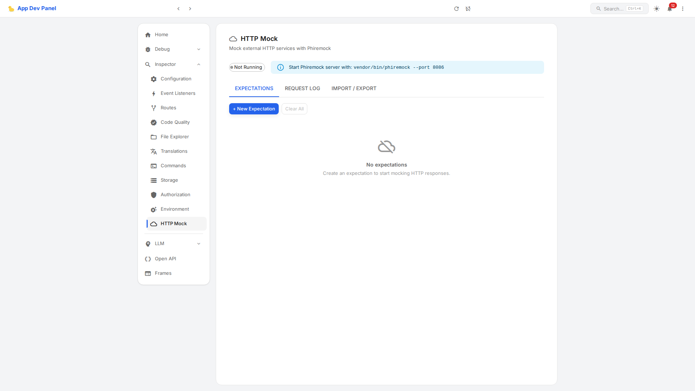
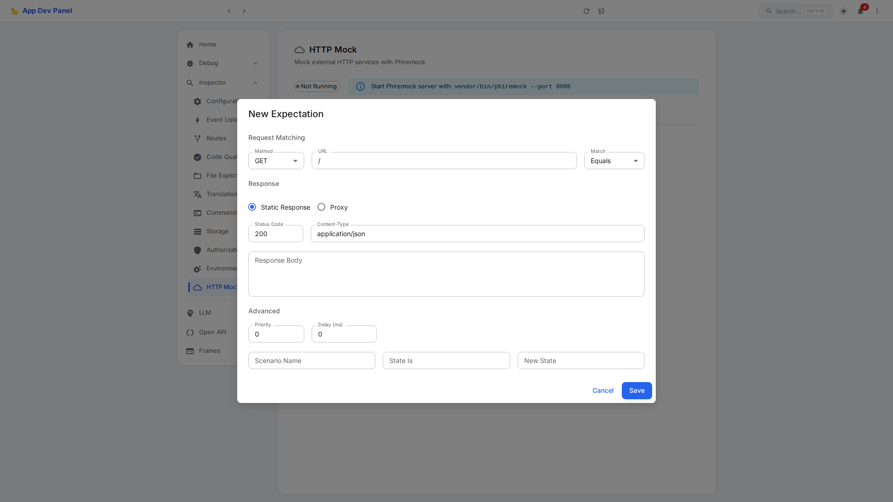

# HTTP Mock Server

## Overview

Inspector page at `/inspector/http-mock` for mocking external HTTP services using
[Phiremock](https://github.com/mcustiel/phiremock) as the backend engine.
Create, manage, and monitor HTTP mock expectations directly from the ADP panel.



## Quick Start

### 1. Install Phiremock Server

```bash
composer require --dev mcustiel/phiremock-server
```

### 2. Start the Server

```bash
vendor/bin/phiremock --port 8086
```

### 3. Wire the Provider

Register `PhiremockProvider` in your DI container so the `HttpMockController` can
communicate with the running server. If no provider is registered, `NullHttpMockProvider`
is used (returns empty data, server shown as "Not Running").

Example (Yii 3):
```php
use AppDevPanel\Api\Inspector\HttpMock\HttpMockProviderInterface;
use AppDevPanel\Api\Inspector\HttpMock\PhiremockProvider;

return [
    HttpMockProviderInterface::class => new PhiremockProvider('127.0.0.1', 8086),
];
```

### 4. Open the Panel

Navigate to **Inspector > HTTP Mock** in the sidebar. The page shows three tabs:

- **Expectations** — Create, view, and clear mock expectations
- **Request Log** — View requests received by the mock server
- **Import / Export** — Export expectations as JSON or import from JSON

## Creating Expectations

Click **"+ New Expectation"** to open the dialog:



### Request Matching

| Field | Description |
|-------|-------------|
| Method | HTTP method to match (GET, POST, PUT, DELETE, PATCH, HEAD, OPTIONS, ANY) |
| URL | URL pattern to match |
| Match type | **Equals** (exact), **Contains** (substring), **Regex** (pattern) |

### Response

Choose between **Static Response** and **Proxy**:

**Static Response:**
- Status code (200, 404, 500, etc.)
- Content-Type header
- Response body (JSON, text, etc.)

**Proxy:**
- Forward requests to a real URL (e.g., staging server)

### Advanced Options

| Field | Description |
|-------|-------------|
| Priority | Higher values matched first (default: 0) |
| Delay (ms) | Simulate network latency |
| Scenario | Stateful mocking: scenario name, current state, next state |

## Import / Export

- **Export**: Download all expectations as a JSON file
- **Import**: Paste JSON and import expectations (single object or array)

## Architecture

```
Frontend (React)              API (PHP)                    Phiremock Server
/inspector/http-mock    ->  HttpMockController       ->  /__phiremock/*
                              |
                        HttpMockProviderInterface
                          |- PhiremockProvider (real)
                          \- NullHttpMockProvider (fallback)
```

### API Endpoints

| Method | Path | Description |
|--------|------|-------------|
| GET | `/inspect/api/http-mock/status` | Server status (running, host, port) |
| GET | `/inspect/api/http-mock/expectations` | List all expectations |
| POST | `/inspect/api/http-mock/expectations` | Create an expectation |
| DELETE | `/inspect/api/http-mock/expectations` | Clear all expectations |
| POST | `/inspect/api/http-mock/verify` | Count matching requests |
| GET | `/inspect/api/http-mock/history` | Request history log |
| POST | `/inspect/api/http-mock/reset` | Full server reset |

### Files

| File | Purpose |
|------|---------|
| `libs/API/src/Inspector/HttpMock/HttpMockProviderInterface.php` | Provider interface |
| `libs/API/src/Inspector/HttpMock/PhiremockProvider.php` | Phiremock REST API client |
| `libs/API/src/Inspector/HttpMock/NullHttpMockProvider.php` | No-op fallback |
| `libs/API/src/Inspector/Controller/HttpMockController.php` | HTTP endpoints |
| `libs/frontend/.../Inspector/Pages/HttpMockPage.tsx` | React page component |
| `libs/frontend/.../Inspector/API/Inspector.ts` | RTK Query endpoints |

### Phiremock REST API

The `PhiremockProvider` communicates with Phiremock via plain HTTP (no SDK dependency):

| Phiremock Endpoint | Used By |
|--------------------|---------|
| `GET /__phiremock/expectations` | `listExpectations()`, `getStatus()` |
| `POST /__phiremock/expectations` | `createExpectation()` |
| `DELETE /__phiremock/expectations` | `clearExpectations()` |
| `POST /__phiremock/executions` | `verifyRequest()` |
| `GET /__phiremock/executions` | `getRequestHistory()` |
| `POST /__phiremock/reset` | `reset()` |
