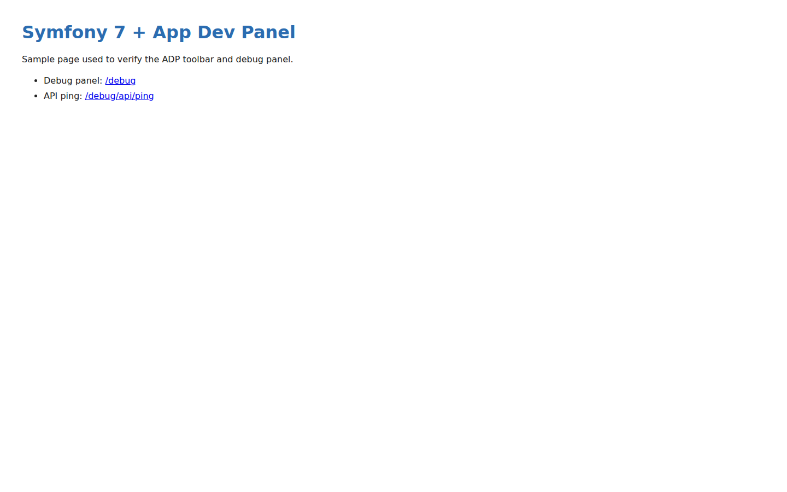
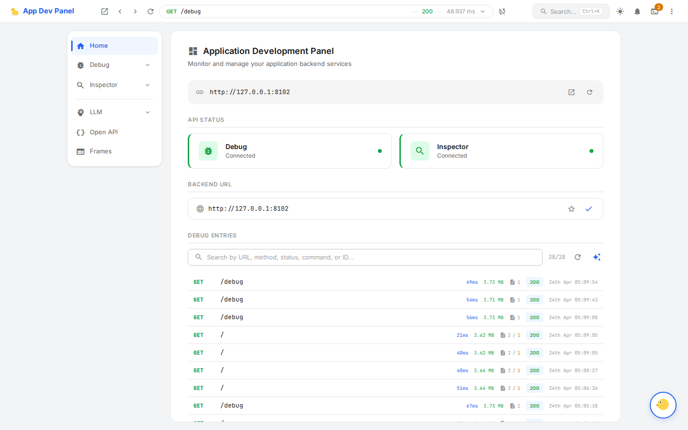
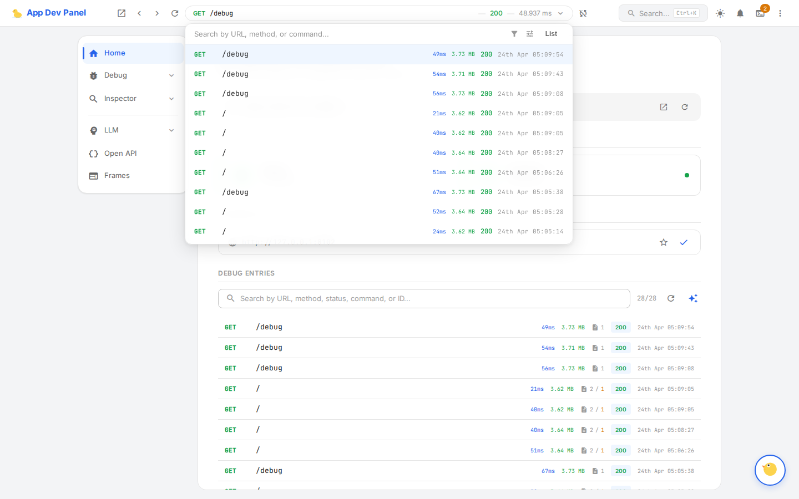

# Symfony 7 + ADP installation report (Packagist, v0.2)

> **Update after PR #248 (`app-dev-panel/frontend-assets`)**: the fixes below have been
> split into two layers. One (docs, CDN fallback `/demo` path, `deploy-docs.yml`
> toolbar assets, stream wrapper warnings, `frontend:update --token/--version`)
> applies to users who still point at `github.io` (e.g. users on a released
> version that predates `frontend-assets`). The other (this branch's second
> commit) wires `app-dev-panel/frontend-assets` through the Symfony adapter so
> the CDN is no longer touched at runtime: a new `AdpAssetController` streams
> `bundle.js` / `bundle.css` / `toolbar/*` from the composer-installed
> `vendor/app-dev-panel/frontend-assets/dist/` via `/debug-assets/{path}`, and
> `AppDevPanelExtension` switches both `PanelConfig::$staticUrl` and
> `ToolbarConfig::$staticUrl` to `/debug-assets` when the package is present.
> The split workflow (`split.yml`) also now builds the toolbar alongside the
> panel so `dist/toolbar/bundle.js` ships inside `frontend-assets`. Together
> this removes the `github.io` 404s (issues #4 and #5) for the integration path.

Scenario reproduced end-to-end:

1. `composer create-project symfony/skeleton:^7.0 demo-app`
2. `composer require app-dev-panel/adapter-symfony` (from Packagist, resolved to `v0.2`)
3. Followed the steps in `website/guide/adapters/symfony.md` / `website/guide/getting-started.md`.
4. Verified at `http://127.0.0.1:8102/` (site) and `http://127.0.0.1:8102/debug` (panel).

Screenshots (`docs/install-report-symfony/images/`):

- `images/01-home-with-toolbar.png` — Symfony home page. Toolbar `<div>` + `<script>` are injected into the HTML (verified in page source), but the toolbar UI does not render — see issue #5 below.
- `images/02-debug-panel.png` — `/debug` renders the full ADP SPA: Home tab, API status (Debug / Inspector both connected), backend URL auto-detected, list of 28 captured debug entries.
- `images/03-debug-list.png` — Debug list view with the captured request log, including the sample `/` and `/debug` hits generated during the walkthrough.





The debug panel works. The toolbar is injected server-side but cannot bootstrap due to issue #5.

---

## Problems encountered during installation

### 1. Docs config example uses an unknown option (`messenger`) — hard failure

`website/guide/adapters/symfony.md` shows:

```yaml
app_dev_panel:
    collectors:
        messenger: true   # requires symfony/messenger
```

Copy-pasting the yaml fails at `cache:clear`:

```
Unrecognized option "messenger" under "app_dev_panel.collectors".
Available options are "assets", "cache", "code_coverage", "command",
 "deprecation", "doctrine", "elasticsearch", "environment", "event",
 "exception", "filesystem_stream", "http_client", "http_stream", "log",
 "mailer", "opentelemetry", "queue", "redis", "request", "router", "security",
 "service", "timeline", "translator", "twig", "validator", "var_dumper".
```

`messenger` is not in `Configuration::addCollectorsNode()`; the closest match is probably `queue`. The docs block is out of sync with the actual config tree. Same doc also lists `doctrine`, `twig`, `security`, `cache`, `mailer`, `assets`, `code_coverage` — those are accepted — so the regression is only on `messenger`.

**Fix**: either remove `messenger` from the documented example or wire up the queue/messenger collector under that key (alias).

### 2. No Symfony Flex recipe — bundle + config + routes must be registered by hand

`composer require app-dev-panel/adapter-symfony` prints the usual "Configuring …" block only for transitive packages (e.g. `nyholm/psr7`). No recipe runs for the adapter itself, so none of the following are auto-created:

- `config/bundles.php` entry
- `config/packages/app_dev_panel.yaml`
- a `config/routes/app_dev_panel.php` that imports the bundle's routes

The first two are documented, but step #3 is not — see issue #3.

**Fix**: publish a Flex recipe at `symfony/recipes-contrib` (or symfony/recipes) that drops the three files in place.

### 3. Route wiring step is missing from the installation docs

After registering the bundle and dropping in `app_dev_panel.yaml`, `bin/console debug:router` still shows only `_preview_error` and the user's own routes. The `/debug` URL returns 404 and the toolbar-injected `<script>` cannot reach `/debug/api/settings` because none of the ADP routes are loaded.

The adapter ships routes at `vendor/app-dev-panel/adapter-symfony/config/routes/adp.php`, and the playground wires them via `playground/symfony-app/config/routes/app_dev_panel.php`:

```php
return static function (RoutingConfigurator $routes): void {
    $routes->import('@AppDevPanelBundle/config/routes/adp.php');
};
```

But neither `website/guide/adapters/symfony.md` nor `website/guide/getting-started.md` mentions this. Following the docs verbatim yields an app where the bundle is registered but the panel/API endpoints do not exist.

**Fix options**: (a) document the import snippet as step 3; (b) have the bundle auto-register its routes via `Bundle::loadExtension()` / `BundleInterface::registerContainerConfiguration()` or a `RoutingResolver` so no user action is needed.

### 4. Default panel/toolbar `staticUrl` points to a 404 path on GitHub Pages

`AppDevPanel\Api\Panel\PanelConfig::DEFAULT_STATIC_URL = 'https://app-dev-panel.github.io/app-dev-panel'`. The adapter emits the following asset URLs into every HTML response:

- panel:   `{staticUrl}/bundle.js`, `{staticUrl}/bundle.css`
- toolbar: `{staticUrl}/toolbar/bundle.js`, `{staticUrl}/toolbar/bundle.css`

But `.github/workflows/deploy-docs.yml` copies the toolbar build to `website/.vitepress/dist/demo/toolbar/`, not to the dist root. Result:

| URL | HTTP |
|---|---|
| `https://app-dev-panel.github.io/app-dev-panel/bundle.js` | 200 (copied to dist root, works by accident) |
| `https://app-dev-panel.github.io/app-dev-panel/toolbar/bundle.js` | **404** |
| `https://app-dev-panel.github.io/app-dev-panel/toolbar/bundle.css` | **404** |
| `https://app-dev-panel.github.io/app-dev-panel/demo/toolbar/bundle.js` | 200 |
| `https://app-dev-panel.github.io/app-dev-panel/demo/toolbar/bundle.css` | 200 |

Workaround applied in this report:

```yaml
app_dev_panel:
    panel:
        static_url: 'https://app-dev-panel.github.io/app-dev-panel/demo'
    toolbar:
        static_url: 'https://app-dev-panel.github.io/app-dev-panel/demo'
```

**Fix**: either change `PanelConfig::DEFAULT_STATIC_URL` to include `/demo`, or publish the release artifacts at the dist root.

### 5. Toolbar bundle references chunks that are not deployed anywhere on the CDN

Even after pointing at `/demo/toolbar/bundle.js`, the file contains a static import:

```js
import { n as e, t } from "./assets/preload-helper--XgcBzeW.js";
```

which resolves to `https://app-dev-panel.github.io/app-dev-panel/demo/toolbar/assets/preload-helper--XgcBzeW.js`. That URL — and every other `./assets/*` the toolbar imports — returns 404. The chunk isn't at `/demo/assets/`, `/assets/`, `/demo/`, or `/demo/toolbar/assets/` either (all four probed, all 404). Browser console:

```
Failed to load resource: net::ERR_ABORTED
  demo/toolbar/assets/preload-helper--XgcBzeW.js
```

The import throws, the bundle never executes, and `#app-dev-toolbar` stays empty (`height: 0` in the screenshot). This is a release/deploy defect: the toolbar's `assets/` sibling directory is not included in the GitHub Pages artifact. The panel build has the same splitting scheme but works because its `assets/` dir **is** copied (`cp -r libs/frontend/packages/panel/dist/assets` in the workflow).

**Fix options**: (a) add `cp -r libs/frontend/packages/toolbar/dist/assets website/.vitepress/dist/demo/toolbar/assets` to the deploy workflow; (b) build the toolbar with `build.rollupOptions.output.inlineDynamicImports: true` so it's a single self-contained file.

### 6. `frontend:update download` (workaround for offline/CSP) is gated by the anonymous GitHub API rate limit

Per docs the CDN can be replaced with locally-served assets via `bin/console frontend:update download --path=public/_adp`. That command fails instantly on any shared IP that has recently hit the anonymous `api.github.com` quota:

```
[ERROR] Failed to fetch release info: Client error: GET
 https://api.github.com/repos/app-dev-panel/app-dev-panel/releases/latest
 resulted in a 403 Forbidden response:
 {"message":"API rate limit exceeded for 35.192.191.42..."}
```

There is no `--token`, `GITHUB_TOKEN`, or "use a specific release URL" escape hatch exposed on the command. For CI or shared hosts this is unusable.

**Fix**: accept a `GITHUB_TOKEN` env var (the API recognises `Authorization: Bearer …`) and/or allow passing an explicit `--version` / direct-URL mode that bypasses `/releases/latest`.

### 7. Stream-wrapper warnings from `FilesystemStreamProxy` on `cache:clear`

First `cache:clear` after wiring the bundle emits repeated PHP warnings:

```
PHP Warning: fopen(.../var/cache/de_/ContainerLlZbCYe/getCacheWarmerService.php):
  Failed to open stream: No such file or directory in
  vendor/app-dev-panel/kernel/src/Helper/StreamWrapper/StreamWrapper.php:131

PHP Warning: file(.../getCacheWarmerService.php): "AppDevPanel\Kernel\Collector
  \Stream\FilesystemStreamProxy::stream_open" call failed in
  vendor/yiisoft/var-dumper/src/ClosureExporter.php:59
```

Given this repo's policy (`CLAUDE.md` § "Zero Tolerance"), any PHP warning in a dev flow is a regression candidate. The wrapper is trying to `fopen` a cache file that Symfony's `cache:clear` already deleted. This doesn't break installation but is noisy and would fail any strict-error suite.

**Fix**: make `FilesystemStreamProxy::stream_open` skip the proxy logic (or just fail silently) when the underlying file does not exist, instead of letting the `include` cascade surface a warning.

---

## What worked

- `composer require` resolved cleanly and pulled in `kernel`, `api`, `cli`, `mcp-server` at `v0.2`.
- After manual route wiring + `static_url` override, `/debug` serves the full panel; the SPA connects to `http://127.0.0.1:8102` (backend URL) and lists all captured requests in real time.
- `/debug/api/settings`, `/debug/api` (list) return proper JSON envelopes (`{id, data, error, success}`).
- Toolbar HTML injection into `text/html` responses is working correctly — the div, config script, and CSS link are all emitted (see page source). Only the JS bundle fails due to #5.

## Final working config (what the docs *should* produce)

```yaml
# config/packages/app_dev_panel.yaml
app_dev_panel:
    enabled: true
    storage:
        path: '%kernel.project_dir%/var/debug'
        history_size: 50
    collectors:
        request: true
        exception: true
        log: true
        event: true
        cache: true
    ignored_requests: ['/_wdt/*', '/_profiler/*', '/debug/api/**']
    api:
        enabled: true
        allowed_ips: ['127.0.0.1', '::1']
    panel:
        static_url: 'https://app-dev-panel.github.io/app-dev-panel/demo'
    toolbar:
        static_url: 'https://app-dev-panel.github.io/app-dev-panel/demo'
```

```php
// config/bundles.php
return [
    Symfony\Bundle\FrameworkBundle\FrameworkBundle::class => ['all' => true],
    AppDevPanel\Adapter\Symfony\AppDevPanelBundle::class => ['dev' => true, 'test' => true],
];

// config/routes/app_dev_panel.php
return static function (RoutingConfigurator $routes): void {
    $routes->import('@AppDevPanelBundle/config/routes/adp.php');
};
```
