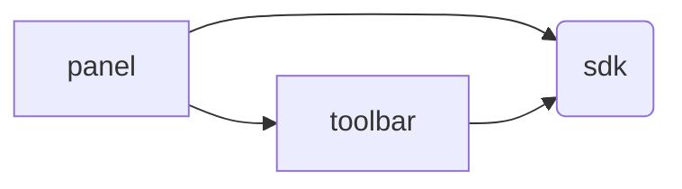

# ADP Frontend Monorepo

React/TypeScript frontend for the Application Development Panel.

## Packages

### [`@app-dev-panel/panel`](packages/panel/README.md)

Main SPA application — debug viewer, inspector (20+ pages), code generation, OpenAPI browser.

### [`@app-dev-panel/sdk`](packages/sdk/)

Shared SDK — API clients (RTK Query), reusable components, theming, search/filter helpers.

### [`@app-dev-panel/toolbar`](packages/toolbar/)

Embeddable toolbar widget for displaying debug summary directly on the page.

### Dependency Graph



## Tech Stack

- React 18, TypeScript 5.5, Vite 5.4
- Material-UI 5 with custom dark/light theming
- Redux Toolkit + RTK Query
- Lerna 8 (monorepo management)
- Prettier 3.8+, ESLint 9

## Development

```bash
npm install              # Install all workspace dependencies
npm start                # Start all Vite dev servers
npm run build            # Production build all packages
npm run check            # Run all code quality checks (Prettier + ESLint)
```

### Running with a Backend

Start any playground backend (Laravel, Symfony, Yii 3, or Yii 2) and point the panel to it:

```bash
# Terminal 1: Start a playground
cd ../../playground/laravel-app && php artisan serve --port=8104

# Terminal 2: Start the frontend
npm start
```

Open `http://localhost:3000` and set the backend URL in settings.

## Documentation

- [Frontend Architecture](CLAUDE.md)
- [SDK Reference](docs/sdk.md)

## License

BSD-3-Clause. See [LICENSE.md](./LICENSE.md) for details.
