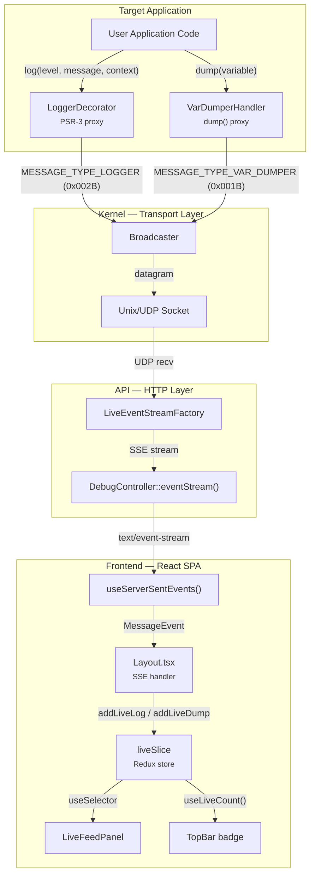
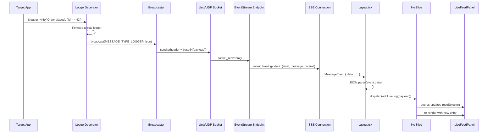
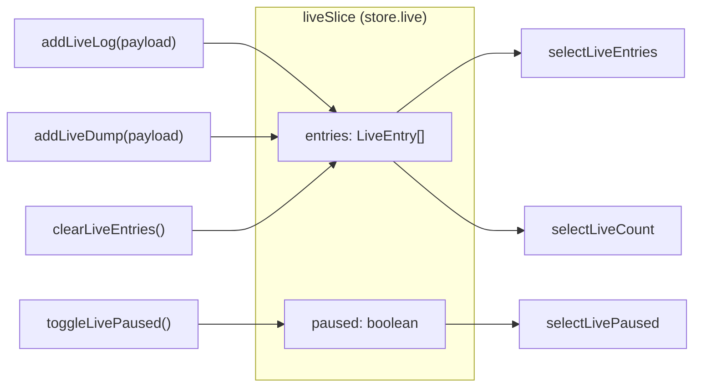
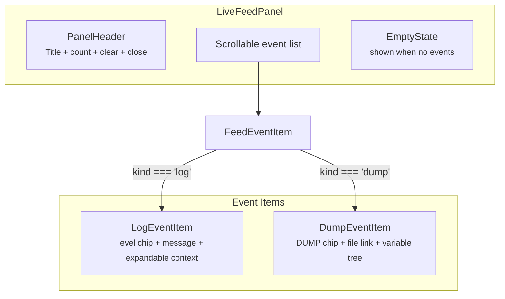

# Live Feed — Developer Guide

This page covers the internal architecture of the Live Feed feature for developers who want to understand, extend, or debug the real-time event pipeline.

## Architecture Overview



## Data Flow — Step by Step



## Backend Components

### Broadcaster

**File**: `libs/Kernel/src/DebugServer/Broadcaster.php`

The Broadcaster is the transport layer. It discovers running debug server sockets via filesystem glob patterns and sends UDP datagrams.

| Platform | Discovery pattern | Socket type |
|----------|------------------|-------------|
| Linux/macOS | `adp-debug-server-*.sock` | Unix domain socket |
| Windows | `adp-debug-server-*.port` | UDP socket |

**Datagram format**: 8-byte length header (pack `P`) + base64-encoded JSON payload.

### LoggerDecorator

**File**: `libs/Kernel/src/DebugServer/LoggerDecorator.php`

PSR-3 `LoggerInterface` decorator. Intercepts every `log()` call and broadcasts the message before delegating to the actual logger.

**Broadcast payload** (JSON):
```json
{
    "level": "info",
    "message": "Order placed",
    "context": {"id": 42}
}
```

### VarDumperHandler

**File**: `libs/Kernel/src/DebugServer/VarDumperHandler.php`

Intercepts `dump()` calls. Broadcasts the variable value and source file location.

**Broadcast payload** (JSON):
```json
{
    "variable": {"type": "array", "value": [...]},
    "line": "src/Controller/OrderController.php:42"
}
```

### LiveEventStreamFactory

**File**: `libs/API/src/Debug/LiveEventStreamFactory.php`

Creates the SSE stream response. Binds a UDP socket, receives datagrams, parses them, and maps message types to SSE event names.

| Message type constant | Hex | SSE event name |
|-----------------------|-----|----------------|
| `MESSAGE_TYPE_LOGGER` | `0x002B` | `live-log` |
| `MESSAGE_TYPE_VAR_DUMPER` | `0x001B` | `live-dump` |
| `MESSAGE_TYPE_ENTRY_CREATED` | `0x003B` | `entry-created` |

**Socket configuration**: 50ms receive timeout, non-blocking. Falls back to heartbeat-only mode when the `sockets` PHP extension is not available.

### DebugController::eventStream()

**File**: `libs/API/src/Debug/Controller/DebugController.php`

HTTP endpoint at `/debug/api/event-stream`. Creates an SSE response with a 30-second deadline. The response streams events as `text/event-stream` using `LiveEventStreamFactory`.

### Broadcast CLI Command

**File**: `libs/Cli/src/Command/DebugServerBroadcastCommand.php`  
**Command**: `dev:broadcast`

Sends test events to all connected SSE listeners. Broadcasts as both `MESSAGE_TYPE_LOGGER` and `MESSAGE_TYPE_VAR_DUMPER` simultaneously.

```bash
php yii dev:broadcast -m "Test message"
```

## Frontend Components

### SSE Hook — `useServerSentEvents`

**File**: `sdk/src/Component/useServerSentEvents.ts`

Manages the SSE connection lifecycle. Creates an `EventSource` to `/debug/api/event-stream` and dispatches incoming events to the callback.

```typescript
useServerSentEvents(backendUrl, onUpdatesHandler, autoLatest);
```

The hook reconnects automatically when `backendUrl` changes. The `subscribe` flag (controlled by the `autoLatest` toggle) controls whether the connection is active.

### SSE Event Types

**File**: `sdk/src/Component/useServerSentEvents.ts`

```typescript
enum EventTypesEnum {
    DebugUpdated = 'debug-updated',
    EntryCreated = 'entry-created',
    LiveLog = 'live-log',
    LiveDump = 'live-dump',
}
```

### Layout SSE Handler

**File**: `panel/src/Application/Component/Layout.tsx`

The `onUpdatesHandler` callback in Layout processes all SSE events. For live events:

```typescript
if (data.type === EventTypesEnum.LiveLog) {
    dispatch(addLiveLog(data.payload));
} else if (data.type === EventTypesEnum.LiveDump) {
    dispatch(addLiveDump(data.payload));
}
```

### Redux State — `liveSlice`

**File**: `sdk/src/API/Debug/LiveContext.ts`

Redux Toolkit slice managing live event state. Registered in the store via `sdk/src/API/Debug/api.ts`.



**State shape**:
```typescript
type LiveState = {
    entries: LiveEntry[];  // max 500, newest first
    paused: boolean;       // when true, new events are dropped
};
```

**Entry types**:
```typescript
type LiveLogEntry = {
    id: string;            // nanoid()
    kind: 'log';
    timestamp: number;     // Date.now()
    payload: {
        level: string;
        message: string;
        context?: Record<string, unknown>;
    };
};

type LiveDumpEntry = {
    id: string;
    kind: 'dump';
    timestamp: number;
    payload: {
        variable: unknown;
        line?: string;
    };
};

type LiveEntry = LiveLogEntry | LiveDumpEntry;
```

**Actions**:

| Action | Description |
|--------|-------------|
| `addLiveLog(payload)` | Prepend a log entry. Ignored when paused. Trims to 500 max. |
| `addLiveDump(payload)` | Prepend a dump entry. Ignored when paused. Trims to 500 max. |
| `clearLiveEntries()` | Remove all entries |
| `toggleLivePaused()` | Toggle pause state |
| `setLivePaused(bool)` | Set pause state explicitly |

**Selectors / Hooks**:

| Hook | Returns |
|------|---------|
| `useLiveEntries()` | `LiveEntry[]` — all entries, newest first |
| `useLiveCount()` | `number` — total entry count |
| `useLivePaused()` | `boolean` — whether intake is paused |

### Panel Open State — `ApplicationSlice`

**File**: `sdk/src/API/Application/ApplicationContext.tsx`

The `liveFeedOpen` boolean is stored in the persisted `application` slice (survives page reloads via `redux-persist` + localStorage).

```typescript
// Toggle the panel
dispatch(toggleLiveFeed());

// Read the state
const liveFeedOpen = useSelector((state) => state.application.liveFeedOpen ?? false);
```

### LiveFeedPanel

**File**: `panel/src/Application/Component/LiveFeedPanel.tsx`

Inline panel component (380px width). Renders as a third column in the layout alongside the sidebar and content area.



**Sub-components**:

| Component | Purpose |
|-----------|---------|
| `PanelRoot` | Styled wrapper (380px, flex column, paper background, border) |
| `PanelHeader` | Title bar with event count, clear button, close button |
| `LogEventItem` | Renders log entries with level-colored chip and expandable context tree |
| `DumpEventItem` | Renders dump entries with file link and expandable variable tree |
| `FeedEventItem` | Dispatcher that picks the right component based on `entry.kind` |

**Level color mapping**:

| Level | Color |
|-------|-------|
| emergency, alert, critical, error | `theme.palette.error.main` (red) |
| warning | `theme.palette.warning.main` (orange) |
| notice | `theme.palette.primary.main` (blue) |
| info | `theme.palette.success.main` (green) |
| debug | `theme.palette.text.disabled` (grey) |

### TopBar Integration

**File**: `sdk/src/Component/Layout/TopBar.tsx`

The TopBar shows a terminal icon button with a badge counter. Props:

| Prop | Type | Description |
|------|------|-------------|
| `liveFeedCount` | `number?` | Badge value (total events in store) |
| `liveFeedActive` | `boolean?` | Whether panel is open (highlights button) |
| `onLiveFeedClick` | `() => void` | Toggle handler |

When active, the button gets `backgroundColor: 'action.selected'` and the icon turns `'primary.main'` color.

### Layout Integration

**File**: `panel/src/Application/Component/Layout.tsx`

The Layout renders the panel as an inline third column (not a Drawer overlay):

```tsx
<MainInner expanded={liveFeedOpen && !isMobile}>
    {!isMobile && <UnifiedSidebar ... />}
    <ContentArea>
        <Outlet />
    </ContentArea>
    {liveFeedOpen && !isMobile && <LiveFeedPanel onClose={handleLiveFeedClick} />}
</MainInner>
```

`MainInner` accepts an `expanded` prop that removes `maxWidth` when the panel is open, giving the three-column layout enough room.

The panel is hidden on mobile (`isMobile` = below `md` breakpoint).

## Complete File Map

| File | Layer | Purpose |
|------|-------|---------|
| `Kernel/src/DebugServer/Broadcaster.php` | Backend | UDP datagram sender |
| `Kernel/src/DebugServer/LoggerDecorator.php` | Backend | PSR-3 log interceptor |
| `Kernel/src/DebugServer/VarDumperHandler.php` | Backend | dump() interceptor |
| `Kernel/src/DebugServer/Connection.php` | Backend | Socket constants and discovery |
| `API/src/Debug/LiveEventStreamFactory.php` | Backend | SSE stream builder |
| `API/src/Debug/Controller/DebugController.php` | Backend | `/debug/api/event-stream` endpoint |
| `Cli/src/Command/DebugServerBroadcastCommand.php` | Backend | `dev:broadcast` CLI command |
| `sdk/src/Component/useServerSentEvents.ts` | Frontend | SSE connection hook |
| `sdk/src/Component/ServerSentEventsObserver.ts` | Frontend | SSE EventSource wrapper |
| `sdk/src/API/Debug/LiveContext.ts` | Frontend | Redux slice + selectors |
| `sdk/src/API/Debug/api.ts` | Frontend | Slice registration |
| `sdk/src/API/Application/ApplicationContext.tsx` | Frontend | `liveFeedOpen` persisted state |
| `sdk/src/Component/Layout/TopBar.tsx` | Frontend | Badge + toggle button |
| `panel/src/Application/Component/Layout.tsx` | Frontend | SSE handling + panel mount |
| `panel/src/Application/Component/LiveFeedPanel.tsx` | Frontend | Panel UI |
