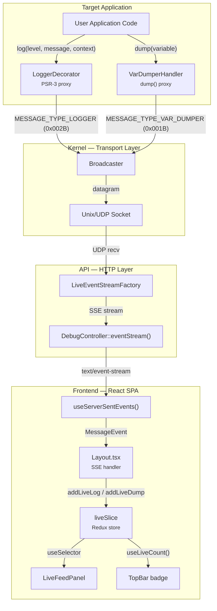
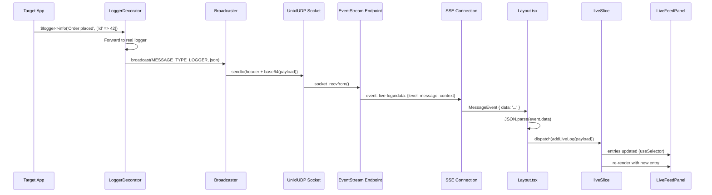
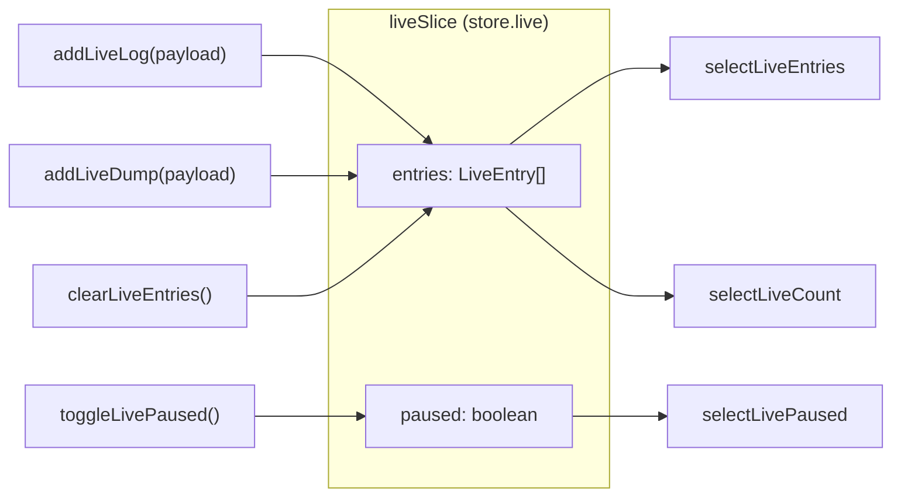
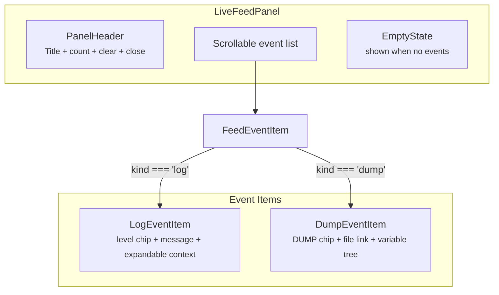

# Live Feed — руководство разработчика

Эта страница описывает внутреннюю архитектуру функции Live Feed для разработчиков, которые хотят понять, расширить или отладить конвейер событий реального времени.

## Обзор архитектуры



## Поток данных — шаг за шагом



## Компоненты бэкенда

### Broadcaster

**Файл**: `libs/Kernel/src/DebugServer/Broadcaster.php`

Broadcaster — это транспортный слой. Он обнаруживает сокеты работающих debug-серверов по glob-шаблонам в файловой системе и отправляет UDP-датаграммы.

| Платформа | Шаблон обнаружения | Тип сокета |
|-----------|--------------------|------------|
| Linux/macOS | `adp-debug-server-*.sock` | Unix domain socket |
| Windows | `adp-debug-server-*.port` | UDP-сокет |

**Формат датаграммы**: 8-байтовый заголовок длины (pack `P`) + JSON-payload в кодировке base64.

### LoggerDecorator

**Файл**: `libs/Kernel/src/DebugServer/LoggerDecorator.php`

Декоратор PSR-3 `LoggerInterface`. Перехватывает каждый вызов `log()` и транслирует сообщение перед делегированием реальному логгеру.

**Транслируемый payload** (JSON):
```json
{
    "level": "info",
    "message": "Order placed",
    "context": {"id": 42}
}
```

### VarDumperHandler

**Файл**: `libs/Kernel/src/DebugServer/VarDumperHandler.php`

Перехватывает вызовы `dump()`. Транслирует значение переменной и расположение исходного файла.

**Транслируемый payload** (JSON):
```json
{
    "variable": {"type": "array", "value": [...]},
    "line": "src/Controller/OrderController.php:42"
}
```

### LiveEventStreamFactory

**Файл**: `libs/API/src/Debug/LiveEventStreamFactory.php`

Создаёт ответ с SSE-потоком. Привязывает UDP-сокет, получает датаграммы, разбирает их и сопоставляет типы сообщений с именами SSE-событий.

| Константа типа сообщения | Hex | Имя SSE-события |
|--------------------------|-----|-----------------|
| `MESSAGE_TYPE_LOGGER` | `0x002B` | `live-log` |
| `MESSAGE_TYPE_VAR_DUMPER` | `0x001B` | `live-dump` |
| `MESSAGE_TYPE_ENTRY_CREATED` | `0x003B` | `entry-created` |

**Конфигурация сокета**: таймаут приёма 50 мс, неблокирующий режим. Если PHP-расширение `sockets` недоступно, переключается в режим только heartbeat.

### DebugController::eventStream()

**Файл**: `libs/API/src/Debug/Controller/DebugController.php`

HTTP-эндпоинт по адресу `/debug/api/event-stream`. Создаёт SSE-ответ с дедлайном 30 секунд. Ответ передаёт события как `text/event-stream`, используя `LiveEventStreamFactory`.

### CLI-команда Broadcast

**Файл**: `libs/Cli/src/Command/DebugServerBroadcastCommand.php`  
**Команда**: `dev:broadcast`

Отправляет тестовые события всем подключённым SSE-слушателям. Транслирует одновременно как `MESSAGE_TYPE_LOGGER`, так и `MESSAGE_TYPE_VAR_DUMPER`.

```bash
php yii dev:broadcast -m "Test message"
```

## Компоненты фронтенда

### SSE-хук — `useServerSentEvents`

**Файл**: `sdk/src/Component/useServerSentEvents.ts`

Управляет жизненным циклом SSE-соединения. Создаёт `EventSource` к `/debug/api/event-stream` и передаёт входящие события в callback.

```typescript
useServerSentEvents(backendUrl, onUpdatesHandler);
```

Хук автоматически переподключается при изменении `backendUrl`. Соединение всегда активно, поэтому Live Feed получает события независимо от переключателя `autoLatest` в списке записей.

### Типы SSE-событий

**Файл**: `sdk/src/Component/useServerSentEvents.ts`

```typescript
enum EventTypesEnum {
    DebugUpdated = 'debug-updated',
    EntryCreated = 'entry-created',
    LiveLog = 'live-log',
    LiveDump = 'live-dump',
}
```

### Обработчик SSE в Layout

**Файл**: `panel/src/Application/Component/Layout.tsx`

Callback `onUpdatesHandler` в Layout обрабатывает все SSE-события. Для live-событий:

```typescript
if (data.type === EventTypesEnum.LiveLog) {
    dispatch(addLiveLog(data.payload));
} else if (data.type === EventTypesEnum.LiveDump) {
    dispatch(addLiveDump(data.payload));
}
```

### Состояние Redux — `liveSlice`

**Файл**: `sdk/src/API/Debug/LiveContext.ts`

Slice Redux Toolkit, управляющий состоянием live-событий. Регистрируется в store через `sdk/src/API/Debug/api.ts`.



**Форма состояния**:
```typescript
type LiveState = {
    entries: LiveEntry[];  // max 500, newest first
    paused: boolean;       // when true, new events are dropped
};
```

**Типы записей**:
```typescript
type LiveLogEntry = {
    id: string;            // nanoid()
    kind: 'log';
    timestamp: number;     // Date.now()
    payload: {
        level: string;
        message: string;
        context?: Record<string, unknown>;
    };
};

type LiveDumpEntry = {
    id: string;
    kind: 'dump';
    timestamp: number;
    payload: {
        variable: unknown;
        line?: string;
    };
};

type LiveEntry = LiveLogEntry | LiveDumpEntry;
```

**Actions**:

| Action | Описание |
|--------|----------|
| `addLiveLog(payload)` | Добавляет запись лога в начало. Игнорируется в режиме паузы. Обрезает до 500 записей. |
| `addLiveDump(payload)` | Добавляет запись дампа в начало. Игнорируется в режиме паузы. Обрезает до 500 записей. |
| `clearLiveEntries()` | Удаляет все записи |
| `toggleLivePaused()` | Переключает состояние паузы |
| `setLivePaused(bool)` | Явно задаёт состояние паузы |

**Селекторы / хуки**:

| Хук | Возвращает |
|-----|------------|
| `useLiveEntries()` | `LiveEntry[]` — все записи, сначала новые |
| `useLiveCount()` | `number` — общее количество записей |
| `useLivePaused()` | `boolean` — приостановлен ли приём событий |

### Состояние открытости панели — `ApplicationSlice`

**Файл**: `sdk/src/API/Application/ApplicationContext.tsx`

Булево значение `liveFeedOpen` хранится в персистентном slice `application` (переживает перезагрузку страницы благодаря `redux-persist` + localStorage).

```typescript
// Toggle the panel
dispatch(toggleLiveFeed());

// Read the state
const liveFeedOpen = useSelector((state) => state.application.liveFeedOpen ?? false);
```

### LiveFeedPanel

**Файл**: `panel/src/Application/Component/LiveFeedPanel.tsx`

Встроенный компонент панели (ширина 380px). Отображается как третья колонка в макете рядом с боковой панелью и областью контента.



**Подкомпоненты**:

| Компонент | Назначение |
|-----------|------------|
| `PanelRoot` | Стилизованная обёртка (380px, flex column, фон paper, рамка) |
| `PanelHeader` | Заголовок с количеством событий, кнопкой очистки и кнопкой закрытия |
| `LogEventItem` | Отображает записи логов с чипом цвета уровня и раскрываемым деревом контекста |
| `DumpEventItem` | Отображает записи дампов со ссылкой на файл и раскрываемым деревом переменной |
| `FeedEventItem` | Диспетчер, выбирающий нужный компонент по `entry.kind` |

**Соответствие цветов уровням**:

| Уровень | Цвет |
|---------|------|
| emergency, alert, critical, error | `theme.palette.error.main` (красный) |
| warning | `theme.palette.warning.main` (оранжевый) |
| notice | `theme.palette.primary.main` (синий) |
| info | `theme.palette.success.main` (зелёный) |
| debug | `theme.palette.text.disabled` (серый) |

### Интеграция с TopBar

**Файл**: `sdk/src/Component/Layout/TopBar.tsx`

TopBar показывает кнопку с иконкой терминала и счётчиком-бейджем. Props:

| Prop | Тип | Описание |
|------|-----|----------|
| `liveFeedCount` | `number?` | Значение бейджа (общее количество событий в store) |
| `liveFeedActive` | `boolean?` | Открыта ли панель (подсвечивает кнопку) |
| `onLiveFeedClick` | `() => void` | Обработчик переключения |

В активном состоянии кнопка получает `backgroundColor: 'action.selected'`, а иконка окрашивается в цвет `'primary.main'`.

### Интеграция с Layout

**Файл**: `panel/src/Application/Component/Layout.tsx`

Layout отображает панель как встроенную третью колонку (а не как оверлей Drawer):

```tsx
<MainInner expanded={liveFeedOpen && !isMobile}>
    {!isMobile && <UnifiedSidebar ... />}
    <ContentArea>
        <Outlet />
    </ContentArea>
    {liveFeedOpen && !isMobile && <LiveFeedPanel onClose={handleLiveFeedClick} />}
</MainInner>
```

`MainInner` принимает prop `expanded`, который убирает `maxWidth` при открытой панели, давая трёхколоночному макету достаточно места.

На мобильных устройствах панель скрыта (`isMobile` = ниже брейкпоинта `md`).

## Полная карта файлов

| Файл | Слой | Назначение |
|------|------|------------|
| `Kernel/src/DebugServer/Broadcaster.php` | Бэкенд | Отправитель UDP-датаграмм |
| `Kernel/src/DebugServer/LoggerDecorator.php` | Бэкенд | Перехватчик логов PSR-3 |
| `Kernel/src/DebugServer/VarDumperHandler.php` | Бэкенд | Перехватчик dump() |
| `Kernel/src/DebugServer/Connection.php` | Бэкенд | Константы сокетов и обнаружение |
| `API/src/Debug/LiveEventStreamFactory.php` | Бэкенд | Построитель SSE-потока |
| `API/src/Debug/Controller/DebugController.php` | Бэкенд | Эндпоинт `/debug/api/event-stream` |
| `Cli/src/Command/DebugServerBroadcastCommand.php` | Бэкенд | CLI-команда `dev:broadcast` |
| `sdk/src/Component/useServerSentEvents.ts` | Фронтенд | Хук SSE-соединения |
| `sdk/src/Component/ServerSentEventsObserver.ts` | Фронтенд | Обёртка над SSE EventSource |
| `sdk/src/API/Debug/LiveContext.ts` | Фронтенд | Redux slice + селекторы |
| `sdk/src/API/Debug/api.ts` | Фронтенд | Регистрация slice |
| `sdk/src/API/Application/ApplicationContext.tsx` | Фронтенд | Персистентное состояние `liveFeedOpen` |
| `sdk/src/Component/Layout/TopBar.tsx` | Фронтенд | Бейдж + кнопка переключения |
| `panel/src/Application/Component/Layout.tsx` | Фронтенд | Обработка SSE + монтирование панели |
| `panel/src/Application/Component/LiveFeedPanel.tsx` | Фронтенд | UI панели |
